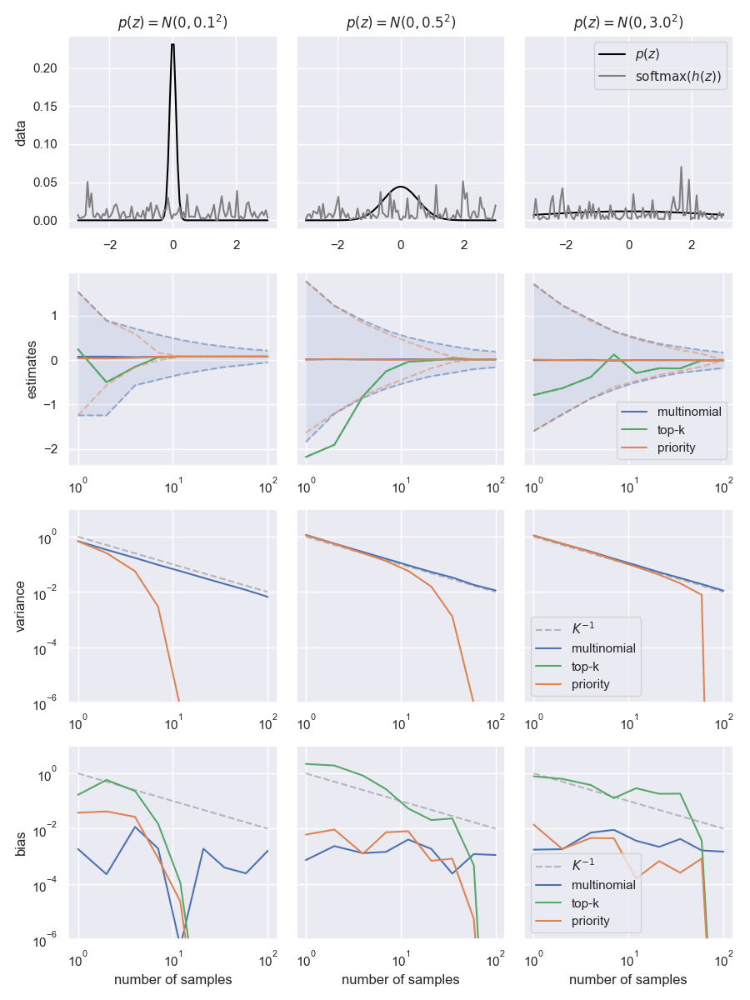

# Variational Open-Domain (VOD)

Core methods (priority sampling, gradients) for Variational Open-Domain QA/LM.

> **Warning**: refactoring in progress, coming soon!

## A. Monte-Carlo estimators for Categorical distributions

This package provides sampling methods to estimate the weighted mean of a function $h(\mathbf{z})$ weighted by a categorical distribution $p(\mathbf{s})$:

$$\mu = \mathbb{E}_{p(\mathbf{z})}[h(\mathbf{z})] $$ 

Estimating the mean via Monte Carlo consists of 
1. Sampling $K$ indices $\mathbf{z}_1, \ldots, \mathbf{z}_K$ from $p(\mathbf{z})$ with weights $\mathbf{s}_1, \ldots, \mathbf{s}_K$. 
2. Computing the weighted mean estimate: $\hat{\mu} = \sum_{i=1}^K s_i h(\mathbf{z}_i)$.



This package provides three samplers:
1. `multinomial`: the standard multinomial sampler (`vod.multinomial_sampler`).
2. `topk`: a top-k sampler (`vod.topk_sampler`).
3. `priority`: a priority sampler (`vod.priority_sampler`).


Samplers come in the form 
```python
class SampleFn(Protocol[Ts]):
    def __call__(self, scores: Ts, n_samples: int) -> Samples[Ts]:
        ...
```
with outputs
```python
Ts = TypeVar("Ts", bound=Union[torch.Tensor, np.ndarray])

@dataclasses.dataclass
class Samples(Generic[Ts]):
    indices: Ts
    log_weights: Ts
```


## B. Gradient estimation

This package implements the VOD objective and its differentiable loss terms. See `vod.vod_objective`.


